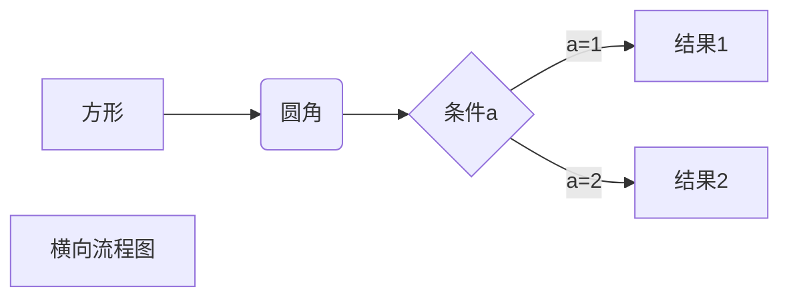
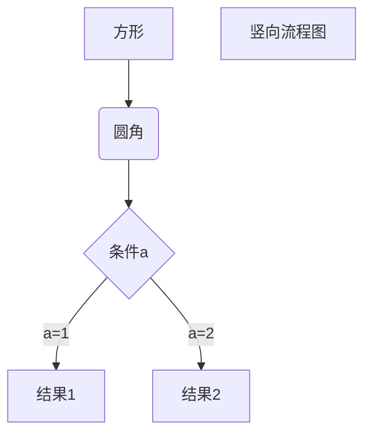
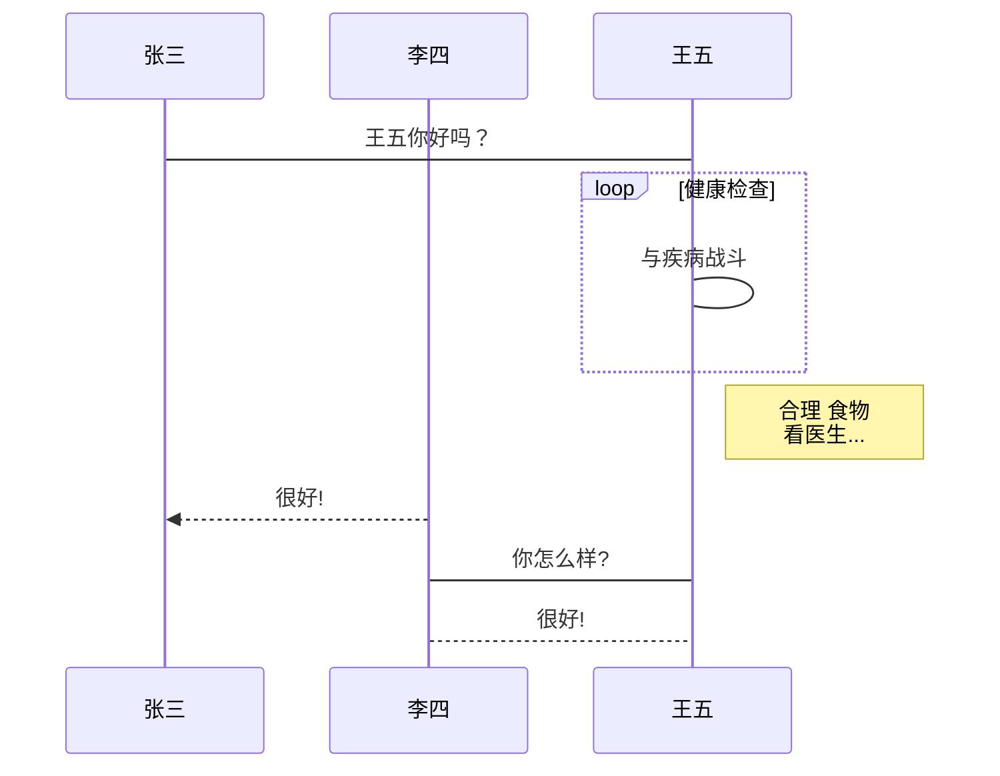
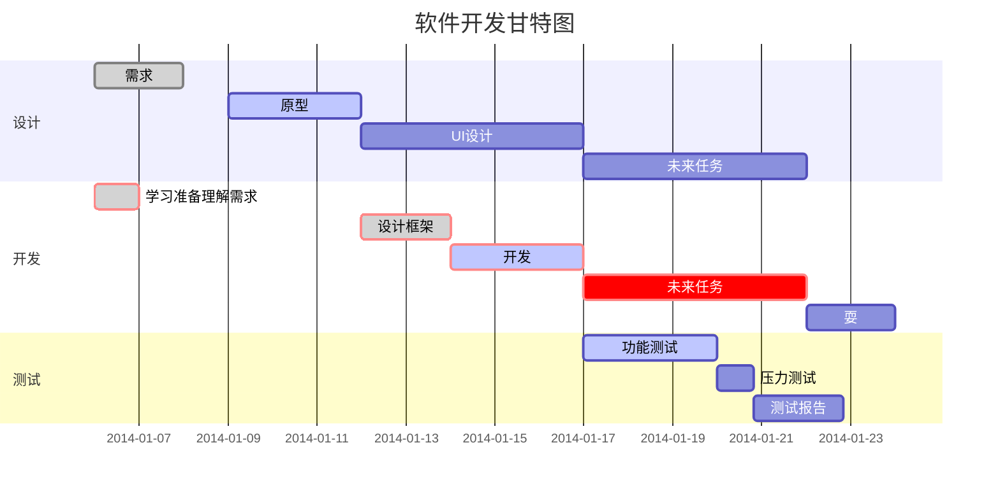
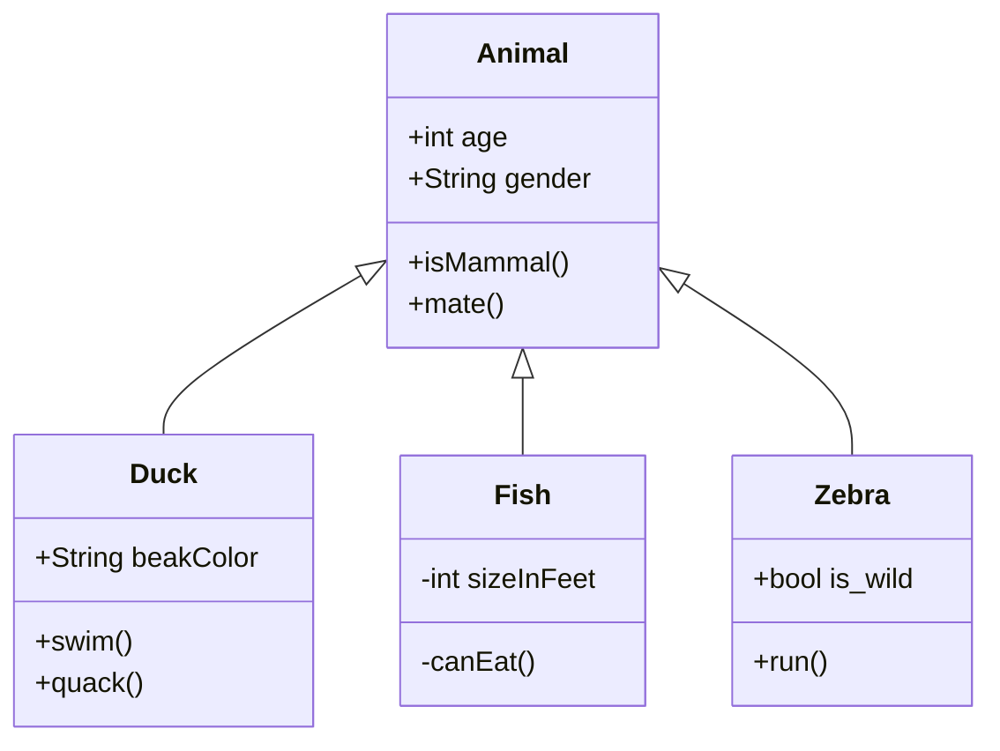
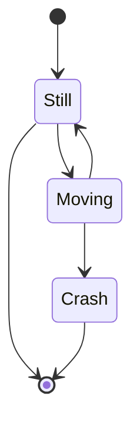
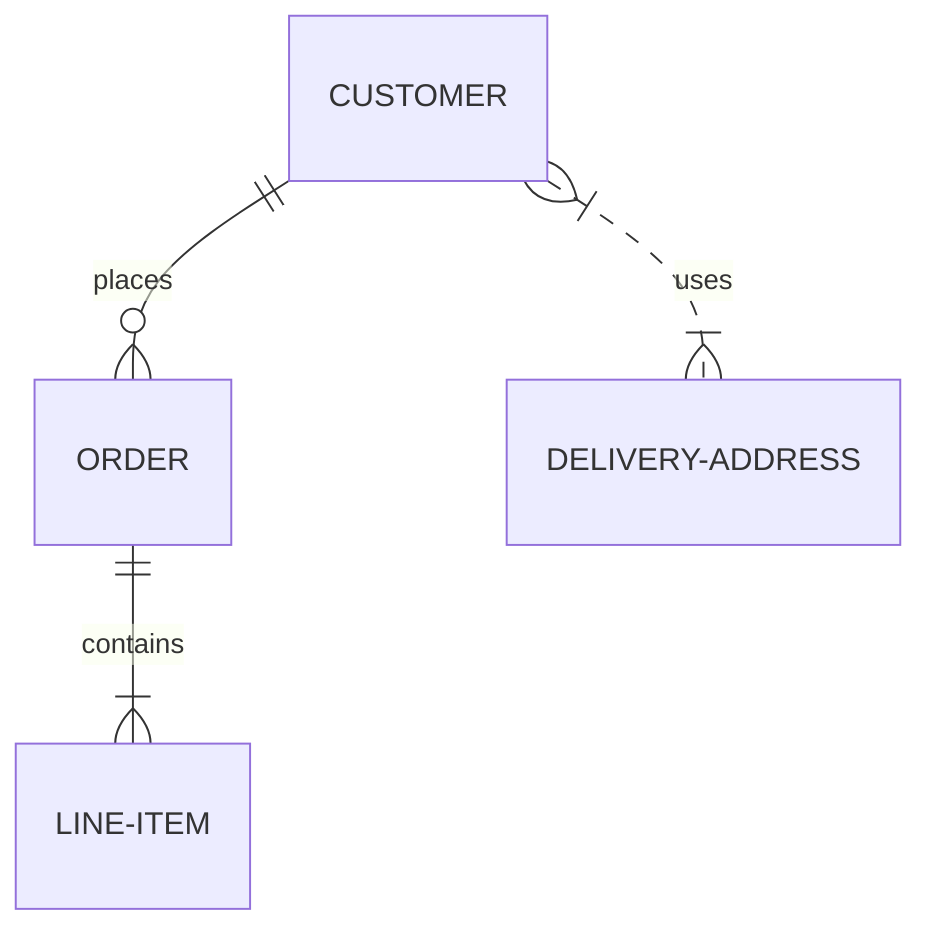
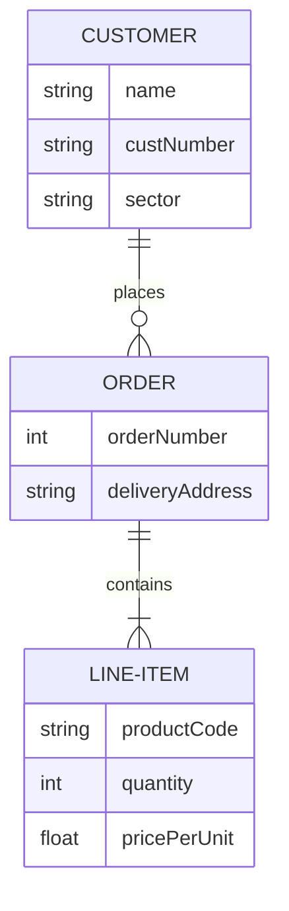
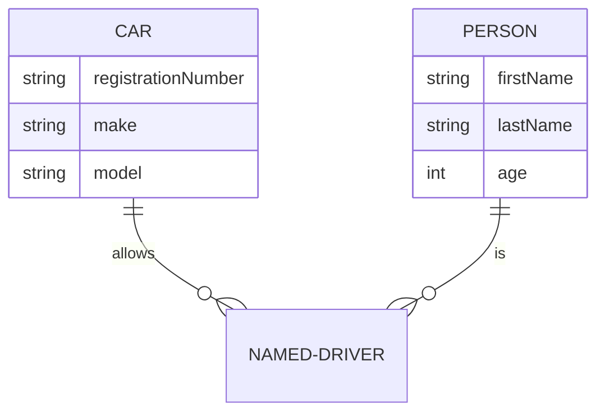
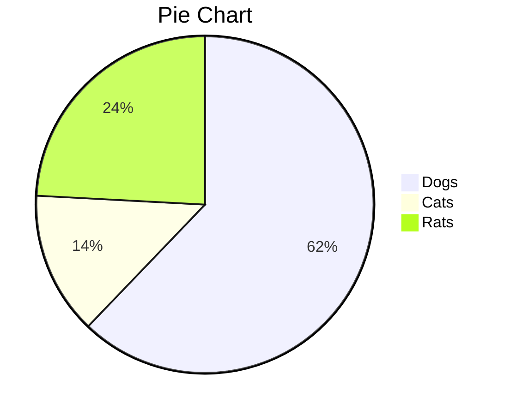

# 快捷键

### Typora快捷键

#### windows快捷键

- 无序列表：输入-之后输入空格
- 有序列表：输入数字+“.”之后输入空格
- 任务列表：-[空格]空格 文字
- 标题：ctrl+数字
- 表格：ctrl+t
- 生成目录：[TOC]按回车
- 选中一整行：ctrl+l
- 选中单词：ctrl+d
- 选中相同格式的文字：ctrl+e
- 跳转到文章开头：ctrl+home
- 跳转到文章结尾：ctrl+end
- 搜索：ctrl+f
- 替换：ctrl+h
- 引用：输入>之后输入空格
- 代码块：ctrl+alt+f
- 加粗：ctrl+b
- 倾斜：ctrl+i
- 下划线：ctrl+u
- 删除线：alt+shift+5
- 插入图片：直接拖动到指定位置即可或者ctrl+shift+i
- 插入链接：ctrl + k

#### Mac中的快捷键

- 最大标题：command + 1 或者：#
- 大标题：command + 2 或者：##
- 标准标题：command + 3 或者：###
- 中标题：command + 4 或者：####
- 小标题：command + 5 或者：#####
- 插入表格：command + T
- 插入代码：command + alt +c
- 行间公式 command + Alt + b
- 段落：command + 0
- 竖线 ： command + Alt +q
- 有序列表（1. 2.） ：输入数字+“.”之后输入空格 或者：command + Alt + o
- 黑点标记：command + Alt + u
- 隔离线shift + command + -
- 超链接：command + Alt + l
- 插入链接：command +k
- 下划线：command +u
- 加粗：command +b
- 搜索：command +f


# 兼容性

## hexo博客兼容性问题

1. 代码语言小写 HTML=html
2. 代码语言简写 MySQL=SQL
3. 代码块标记前不能有空格


# Markdown 语法

## Markdown 标题

Markdown 标题有两种格式。

### 1、使用 = 和 - 标记一级和二级标题

= 和 - 标记语法格式如下：

```
我展示的是一级标题
=================

我展示的是二级标题
-----------------
```


### 使用 # 号标记

使用 **#** 号可表示 1-6 级标题，一级标题对应一个 **#** 号，二级标题对应两个 **#** 号，以此类推。

```
# 一级标题
## 二级标题
### 三级标题
#### 四级标题
##### 五级标题
###### 六级标题
```


## Markdown 段落

Markdown 段落没有特殊的格式，直接编写文字就好，**段落的换行是使用两个以上空格加上回车**。


当然也可以在段落后面使用一个空行来表示重新开始一个段落。


## 字体

Markdown 可以使用以下几种字体：

```
*斜体文本*
_斜体文本_
**粗体文本**
__粗体文本__
***粗斜体文本***
___粗斜体文本___
```

*斜体文本*
_斜体文本_
**粗体文本**
__粗体文本__
***粗斜体文本***
___粗斜体文本___


## 分隔线

你可以在一行中用三个以上的星号、减号、底线来建立一个分隔线，行内不能有其他东西。你也可以在星号或是减号中间插入空格。下面每种写法都可以建立分隔线：

```
***

* * *

*****

- - -

----------
```

---------


## 删除线

如果段落上的文字要添加删除线，只需要在文字的两端加上两个波浪线 **~~删除线~~** 即可，实例如下：

```
RUNOOB.COM
GOOGLE.COM
~~BAIDU.COM~~
```

~~BAIDU.COM~~


## 下划线

下划线可以通过 HTML 的 `<u>` 标签来实现：

```
<u>带下划线文本</u>
```

<u>带下划线文本</u>


## 脚注

脚注是对文本的补充说明。

Markdown 脚注的格式如下:

```
[^要注明的文本]
```

以下实例演示了脚注的用法：

创建脚注格式类似这样 [^RUNOOB]。

[^RUNOOB]: 菜鸟教程 -- 学的不仅是技术，更是梦想！！！


## Markdown 区块

Markdown 区块引用是在段落开头使用 **>** 符号 ，然后后面紧跟一个**空格**符号：

```
> 区块引用
> 菜鸟教程
> 学的不仅是技术更是梦想
```

> 区块引用
> 菜鸟教程
> 学的不仅是技术更是梦想

另外区块是可以嵌套的，一个 **>** 符号是最外层，两个 **>** 符号是第一层嵌套，以此类推退：

```
> 最外层
> > 第一层嵌套
> > > 第二层嵌套
```

> 最外层
> > 第一层嵌套
> >
> > > 第二层嵌套

### 区块中使用列表

区块中使用列表实例如下：

```
> 区块中使用列表
> 1. 第一项
> 2. 第二项
> + 第一项
> + 第二项
> + 第三项
```

> 区块中使用列表
> 1. 第一项
> 2. 第二项
> + 第一项
> + 第二项
> + 第三项

### 列表中使用区块

如果要在列表项目内放进区块，那么就需要在 **>** 前添加四个空格的缩进。

区块中使用列表实例如下：

```
* 第一项
    > 菜鸟教程
    > 学的不仅是技术更是梦想
* 第二项
```

* 第一项
    > 菜鸟教程
    > 学的不仅是技术更是梦想
* 第二项

## Markdown 代码

如果是段落上的一个函数或片段的代码可以用反引号把它包起来（**`**），例如：

```
`printf()` 函数
```

`printf()` 函数

### 代码区块

代码区块使用 **4 个空格**或者一个**制表符（Tab 键）**。

你也可以用 **```** 包裹一段代码，并指定一种语言（也可以不指定）：

```javascript
$(document).ready(function () {
    alert('RUNOOB');
});
```

## Markdown 链接

链接使用方法如下：

```
[链接名称](链接地址)

或者

<链接地址>
```

例如：

这是一个链接 [菜鸟教程](https://www.runoob.com)

### 高级链接

```
链接也可以用变量来代替，文档末尾附带变量地址：
这个链接用 1 作为网址变量 [Google][1]
这个链接用 runoob 作为网址变量 [Runoob][runoob]
然后在文档的结尾为变量赋值（网址）

  [1]: http://www.google.com/
  [runoob]: http://www.runoob.com/
```

链接也可以用变量来代替，文档末尾附带变量地址：
这个链接用 1 作为网址变量 [Google][1]
这个链接用 runoob 作为网址变量 [Runoob][runoob]
然后在文档的结尾为变量赋值（网址）

[1]: http://www.google.com/
[runoob]: http://www.runoob.com/

## Markdown 图片

Markdown 图片语法格式如下：

```


```

- 开头一个感叹号 !
- 接着一个方括号，里面放上图片的替代文字
- 接着一个普通括号，里面放上图片的网址，最后还可以用引号包住并加上选择性的 'title' 属性的文字。

使用实例：


当然，你也可以像网址那样对图片网址使用变量:

```
这个链接用 1 作为网址变量 [RUNOOB][1].
然后在文档的结尾位变量赋值（网址）

[1]: http://static.runoob.com/images/runoob-logo.png
```

这个链接用 1 作为网址变量 [RUNOOB][1].
然后在文档的结尾位变量赋值（网址）

[1]: http://static.runoob.com/images/runoob-logo.png

Markdown 还没有办法指定图片的高度与宽度，如果你需要的话，你可以使用普通的 `` 标签。

```

```


## Markdown 表格

Markdown 制作表格使用 **|** 来分隔不同的单元格，使用 **-** 来分隔表头和其他行。

语法格式如下：

```
|  表头   | 表头  |
|  ----  | ----  |
| 单元格  | 单元格 |
| 单元格  | 单元格 |
```

| 表头   | 表头   |
| ------ | ------ |
| 单元格 | 单元格 |
| 单元格 | 单元格 |

居中方式：`:`

```
|靠左|居中|靠右|
|:--|:-:|-:|
| 1 | 2 | 3 |
```

| 靠左 | 居中 | 靠右 |
| :--- | :--: | ---: |
| 1    |  2   |    3 |


## Markdown 高级技巧

### 支持的 HTML 元素

不在 Markdown 涵盖范围之内的标签，都可以直接在文档里面用 HTML 撰写。

目前支持的 HTML 元素有：`       `等 ，如：

```
使用 <kbd>Ctrl</kbd>+<kbd>Alt</kbd>+<kbd>Del</kbd> 重启电脑
```

输出结果为：

使用 <kbd>Ctrl</kbd>+<kbd>Alt</kbd>+<kbd>Del</kbd> 重启电脑

### 转义

Markdown 使用了很多特殊符号来表示特定的意义，如果需要显示特定的符号则需要使用转义字符，Markdown 使用反斜杠转义特殊字符：

```
**文本加粗** 
\*\* 正常显示星号 \*\*
```

输出结果为：

**文本加粗** 
\*\* 正常显示星号 \*\*


Markdown 支持以下这些符号前面加上反斜杠来帮助插入普通的符号：

```
\   反斜线
`   反引号
*   星号
_   下划线
{}  花括号
[]  方括号
()  小括号
#   井字号
+   加号
-   减号
.   英文句点
!   感叹号
```

### 公式

当你需要在编辑器中插入数学公式时，可以使用两个美元符 $$ 包裹 TeX 或 LaTeX 格式的数学公式来实现。提交后，问答和文章页会根据需要加载 Mathjax 对数学公式进行渲染。如：

```
$$
\mathbf{V}_1 \times \mathbf{V}_2 =  \begin{vmatrix} 
\mathbf{i} & \mathbf{j} & \mathbf{k} \\
\frac{\partial X}{\partial u} &  \frac{\partial Y}{\partial u} & 0 \\
\frac{\partial X}{\partial v} &  \frac{\partial Y}{\partial v} & 0 \\
\end{vmatrix}
$$tep1}{\style{visibility:hidden}{(x+1)(x+1)}}
$$
```

输出结果为：

$$
\mathbf{V}_1 \times \mathbf{V}_2 =  \begin{vmatrix} 
\mathbf{i} & \mathbf{j} & \mathbf{k} \\
\frac{\partial X}{\partial u} &  \frac{\partial Y}{\partial u} & 0 \\
\frac{\partial X}{\partial v} &  \frac{\partial Y}{\partial v} & 0 \\
\end{vmatrix}
$$

# UML 统一建模语言

## 流程图

以下几个实例效果图如下：

**1、横向流程图源码格式：**

````

````


**2、竖向流程图源码格式：**

```
```mermaid
graph TD
A[方形] --> B(圆角)
    B --> C{条件a}
    C --> |a=1| D[结果1]
    C --> |a=2| E[结果2]
    F[竖向流程图]
​```
```



**3、标准流程图源码格式：**

```
```flow
st=>start: 开始框
op=>operation: 处理框
cond=>condition: 判断框(是或否?)
sub1=>subroutine: 子流程
io=>inputoutput: 输入输出框
e=>end: 结束框
st->op->cond
cond(yes)->io->e
cond(no)->sub1(right)->op
​```
```

```flow
st=>start: 开始框
op=>operation: 处理框
cond=>condition: 判断框(是或否?)
sub1=>subroutine: 子流程
io=>inputoutput: 输入输出框
e=>end: 结束框
st->op->cond
cond(yes)->io->e
cond(no)->sub1(right)->op
```

**4、标准流程图源码格式（横向）：**

```
```flow
st=>start: 开始框
op=>operation: 处理框
cond=>condition: 判断框(是或否?)
sub1=>subroutine: 子流程
io=>inputoutput: 输入输出框
e=>end: 结束框
st(right)->op(right)->cond
cond(yes)->io(bottom)->e
cond(no)->sub1(right)->op
​```
```

```flow
st=>start: 开始框
op=>operation: 处理框
cond=>condition: 判断框(是或否?)
sub1=>subroutine: 子流程
io=>inputoutput: 输入输出框
e=>end: 结束框
st(right)->op(right)->cond
cond(yes)->io(bottom)->e
cond(no)->sub1(right)->op
```

## **时序图**

```
```sequence
对象A->对象B: 对象B你好吗?（请求）
Note right of 对象B: 对象B的描述
Note left of 对象A: 对象A的描述(提示)
对象B-->对象A: 我很好(响应)
对象A->对象B: 你真的好吗？
​```
```

```sequence
对象A->对象B: 对象B你好吗?（请求）
Note right of 对象B: 对象B的描述
Note left of 对象A: 对象A的描述(提示)
对象B-->对象A: 我很好(响应)
对象A->对象B: 你真的好吗？
```

**6、UML时序图源码复杂样例：**

```
```sequence
Title: 标题：复杂使用
对象A->对象B: 对象B你好吗?（请求）
Note right of 对象B: 对象B的描述
Note left of 对象A: 对象A的描述(提示)
对象B-->对象A: 我很好(响应)
对象B->小三: 你好吗
小三-->>对象A: 对象B找我了
对象A->对象B: 你真的好吗？
Note over 小三,对象B: 我们是朋友
participant C
Note right of C: 没人陪我玩
​```
```

```sequence
Title: 标题：复杂使用
对象A->对象B: 对象B你好吗?（请求）
Note right of 对象B: 对象B的描述
Note left of 对象A: 对象A的描述(提示)
对象B-->对象A: 我很好(响应)
对象B->小三: 你好吗
小三-->>对象A: 对象B找我了
对象A->对象B: 你真的好吗？
Note over 小三,对象B: 我们是朋友
participant C
Note right of C: 没人陪我玩
```

**7、UML标准时序图样例：**

```
```mermaid
%% 时序图例子,-> 直线，-->虚线，->>实线箭头
  sequenceDiagram
    participant 张三
    participant 李四
    张三->王五: 王五你好吗？
    loop 健康检查
        王五->王五: 与疾病战斗
    end
    Note right of 王五: 合理 食物 <br/>看医生...
    李四-->>张三: 很好!
    王五->李四: 你怎么样?
    李四-->王五: 很好!
​```
```



## 甘特图

```
```mermaid
%% 语法示例
        gantt
        dateFormat  YYYY-MM-DD
        title 软件开发甘特图
        section 设计
        需求                      :done,    des1, 2014-01-06,2014-01-08
        原型                      :active,  des2, 2014-01-09, 3d
        UI设计                     :         des3, after des2, 5d
    未来任务                     :         des4, after des3, 5d
        section 开发
        学习准备理解需求                      :crit, done, 2014-01-06,24h
        设计框架                             :crit, done, after des2, 2d
        开发                                 :crit, active, 3d
        未来任务                              :crit, 5d
        耍                                   :2d
        section 测试
        功能测试                              :active, a1, after des3, 3d
        压力测试                               :after a1  , 20h
        测试报告                               : 48h
​```
```



## 类图




## 状态图



## E-R图






### 2.1 基本语法

```
<first-entity> [<relationship> <second-entity> : <relationship-label>]
```

- first-entity 是实体的名称.名称必须以字母字符开头，也可能包含数字、连字符和下划线.
- relationship 描述了两个实体相互关联的方式.请参阅下文.
- second-entity 是另一个实体的名称.
- relationship-label 从第一个实体的角度描述关系.

```
PROPERTY ||--|{ ROOM : contains
```

-  此语句可以理解为属性包含一个或多个房间，并且一个房间是一个和唯一一个属性的一部分。你可以从第一个实体的角度看到此处的标签：属性包含一个房间，但一个房间不包含属性。从第二个实体的角度考虑时，等效标签通常很容易推断。（某些 ER 图从两个角度标记关系，但此处不支持此关系，并且通常是多余的）。

 只有声明的第一实体部分是强制性的。这使得显示一个没有关系的实体成为可能，这在图表的迭期构造中是有用的。如果指定了语句的任何其他部分，则所有部分都是强制性的。

### 2.2 乌鸦足语法

每个语句的关系部分可以细分为三个子组件：

- 第一个实体与第二个实体的Cardinality，
- 关系是否赋予“孩子”实体身份
- 关于第一个实体的第二个实体的Cardinality

Cardinality是描述另一个实体中有多少元素可以与相关实体相关的属性。在上述示例中，属性可以关联一个或多个 ROOM 实例，而 ROOM 只能与一个属性关联。在每个基数标记中有两个字符。最外层字符表示最大值，最内层字符表示最小值。

乌鸦足表明了实体和实体之间N对N的关系.一共有四种，如下表所示：

| 左值 |右值 |含义 |
| --- | --- | --- |
| \|o | o\|	| 0 或 1|
| \|\| |	\|\| |	1 |
| }o | o{ | 0 或 多（无上限） |
| }\|	| \|{ | 1 或 多（无上限） |

- 关系可以分为识别或非识别，这些关系分别以实心线或虚线呈现。
- 当其中一个实体没有另一个实体不能独立存在时，这是相关的。
  - 例如，为人们驾驶汽车提供保险的公司可能需要将数据存储在NAMED-DIRVER上。在建模时，我们可能首先注意到，CAR可以由许多PERSON实例驱动，而一个PERSON可以驱动许多CAR - 这两个实体都可以在没有其他实体的情况下存在，因此，我们可以在mermaid中指定为：`PERSON {|..|{CAR："driver"`。
  - 请注意，关系中间的两个点将导致两个实体之间划出虚线。
  - 但是，当这种多对多的关系被解决成两个一对多的关系时，我们观察到，没有一个PERSON和一辆CAR，一个NAMED-DRIVER就不可能存在——这种关系变得识别，并将使用连字符进行指定，这转化为一条坚实的线：

```
CAR ||--o{ NAMED-DRIVER : allows
PERSON ||--o{ NAMED-DRIVER : is
```

### 2.3 属性语法

> 需要注意的是，经过小白尝试发现，typora不支持添加属性的ER图语法，即属性语法在typora的mermaid版本中暂（2021.2.24)不成立.

属性可以通过指定实体名称，然后指定包含多个类型名称对的块来定义实体，其中一个块由一对花括号定义。例如：




## 饼状图




# MarkDown 锚点

MarkDown中实现页面跳转的方法如下：

1. 定义锚点目标；锚点目标的定义方式有4种：类Setext形式的标题、类atx形式的标题、带id特性的HTML标签（id特性的值为`目标内容`）、带name特性的a标签（name特性的值为`目标内容`）；
2. 定义锚点；锚点的定义方式有3种：行内式链接、参考式链接、HTML的a链接；

**说明：**

- 锚点 和 锚点目标 的定义不分先后顺序；

**注意：**

- [锚点](#MarkDown 锚点)的 `目标内容` 中不能有大家字母和空格，所以如果锚点目标的 `目标内容` 中有大写字母或空格，则需要在定义锚点中的 `目标内容` 时，把大写字母改成小写字母，把空格改成 `-`；
- 锚点的 目标内容中不能含有以下字符：
  - 半角点(即英文中的句号)`.`
- 标签形式的锚点目标的id特性值中是不能含有中文字符；
- `name` 特性只能应用在 a 标签上；
- HTML5不支持通过a标签的 `name` 特性来定义锚点目标；
- `HTML锚点` 的目标锚点只能是 [标签形式的锚点目标](##示例1)


## 示例1

**锚点：**

```csharp
[跳转到个人简介](#个人简介)
```

**锚点目标：**

```bash
# 个人简介
```

## 示例2

**锚点：**

```csharp
[跳转到个人简介]: #个人简介
[跳转到个人简介][]
```

**锚点目标：**

```undefined
个人简介
=====
```

## 示例3

**锚点：**

```csharp
[跳转到个人简介](#个人简介)
```

**锚点目标：**

```xml
<p id="个人简介">这是个人简介</p>
```

## 示例4

**锚点：**

```csharp
[跳转到个人简介](#个人简介)
```

**锚点目标：**

```xml
<a name="个人简介">这是个人简介</a>
```

## 示例5

**锚点：**

```xml
<a href="#个人简介">跳转到个人简介</a>
```

**锚点目标：**

```undefined
个人简介
----
```

## 示例6

**锚点：**

```xml
<a href="#个人简介">跳转到个人简介</a>
```

**锚点目标：**

```xml
<h1 id="个人简介">这是个人简介</h1>
```

## 示例7

**锚点：**

```xml
<a href="#个人简介">跳转到个人简介</a>
```

**锚点目标：**

```xml
<a name="个人简介">这是个人简介</a>
```

